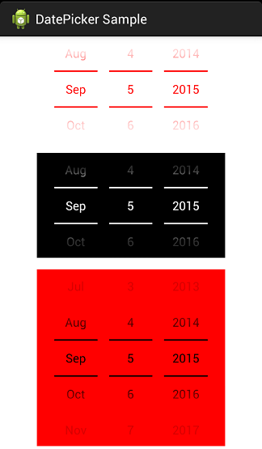

DatePicker
==========

A Holo-style date selection widget can be used in API level 4+. It provides some APIs for you to modify font size, font color,  background color, lines of the numbers and sound effect.

一个Holo风格的日期选择组件。原生的DatePicker没有提供修改样式的Api，只能通过主题来修改，不够灵活，而且只能在sdk版本14以上才能使用。这里基于android.view.View重写了一下，兼容到sdk版本4以上，同时支持自定义字体和背景颜色、字体大小、中文模式右上角角标文字样式、显示的行数、英文显示以及滚动日期的音效。

## ScreenShots




## How to use

### Gradle
Step 1. Add it in your root build.gradle at the end of repositories:

```groovy
allprojects {
	repositories {
		...
		maven { url "https://jitpack.io" }
	}
}
```

Step 2. Add the dependency

```groovy
dependencies {
    compile 'com.github.chenglei1986:DatePicker:-SNAPSHOT'
}
```

### Maven
```groovy
<repositories>
	<repository>
	    <id>jitpack.io</id>
	    <url>https://jitpack.io</url>
	</repository>
</repositories>
```
```groovy
<dependency>
    <groupId>com.github.chenglei1986</groupId>
    <artifactId>DatePicker</artifactId>
    <version>-SNAPSHOT</version>
</dependency>
```

### In your Activity
```java
Sound sound1 = new Sound(this);
mDatePicker1.setSoundEffect(sound1)
	.setTextColor(Color.RED)
	.setFlagTextColor(Color.RED)
	.setTextSize(25)
	.setFlagTextSize(15)
	.setSoundEffectsEnabled(true);
```
```java
Sound sound2 = new Sound(this);
sound2.setCustomSound(R.raw.beep);
mDatePicker2.setSoundEffect(sound2)
	.setTextColor(Color.WHITE)
	.setFlagTextColor(Color.WHITE)
	.setTextSize(25)
	.setFlagTextSize(15)
	.setBackground(Color.BLACK)
	.setSoundEffectsEnabled(true);
```
```java
mDatePicker3.setTextColor(Color.BLACK)
	.setFlagTextColor(Color.BLACK)
	.setBackground(Color.RED)
	.setTextSize(25)
	.setFlagTextSize(15)
	.setRowNumber(5)
	.setOnDateChangedListener(new DatePicker.OnDateChangedListener() {

		@Override
		public void onDateChanged(DatePicker view, int year, int monthOfYear, int dayOfMonth) {
				Log.i("DatePicker", year + "-" + monthOfYear + "-" + dayOfMonth);
		}
	});
```
