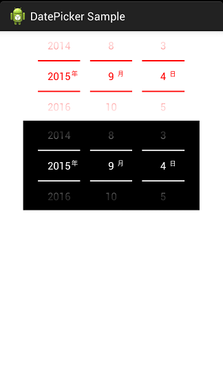

DatePicker
==========
## ScreenShots



## How to use

```java
    Sound sound1 = new Sound(this);
	mDatePicker1.setSoundEffect(sound1)
		.setTextColor(Color.RED)
		.setFlagTextColor(Color.RED)
		.setTextSize(25)
		.setFlagTextSize(15)
		.setSoundEffectsEnabled(true);
```
```java
	Sound sound2 = new Sound(this);
	sound2.setCustomSound(R.raw.beep);
	mDatePicker2.setSoundEffect(sound2)
		.setTextColor(Color.WHITE)
		.setFlagTextColor(Color.WHITE)
		.setTextSize(25)
		.setFlagTextSize(15)
		.setBackground(Color.BLACK)
		.setSoundEffectsEnabled(true);
```